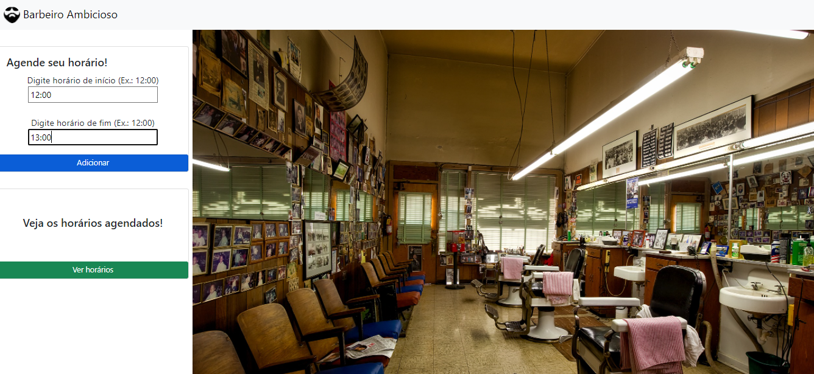

Temas:
 - Greed

# Barbeiro Ambicioso

**Número da Lista**: 8 
**Conteúdo da Disciplina**: Greed 

## Alunos
|Matrícula | Aluno |
| -- | -- |
| 19/0025298  | Bianca Sofia Brasil de Oliveira|
| 19/0026375  | Daniel Vinicius Ribeiro Alves |

## Sobre 
Barbeiro Ambicioso tem como objetivo ajudar barbeiros a organizarem seus horários em sua barbearia de forma eficiente e ambiciosa, com a finalidade de conseguir atender o máximo possível de clientes, já que é uma barbearia muito requisitada.
Para isso usamos o Interval Scheduling para resolvermos essa questão de forma ótima.

## Screenshots
Screenshots do projeto
	
	
	

## Instalação 
**Linguagem**: JavaScript 
Para rodar o projeto localmente, é necessário possuir o node instalado na máquina

Clone o repositório em sua máquina local e baixe as dependências com o comando npm install.

Para executar o projeto: node index.js. O projeto roda na porta: localhost:3000

## Uso 
Após executar o comando para rodar e abrir o localhost:3000, o usuário deve escolher os horários que deseja encaixar em sua agenda, com início e fim e em seguida apertar em ver os horários.

